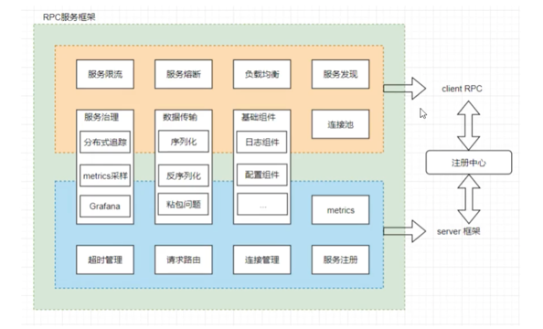
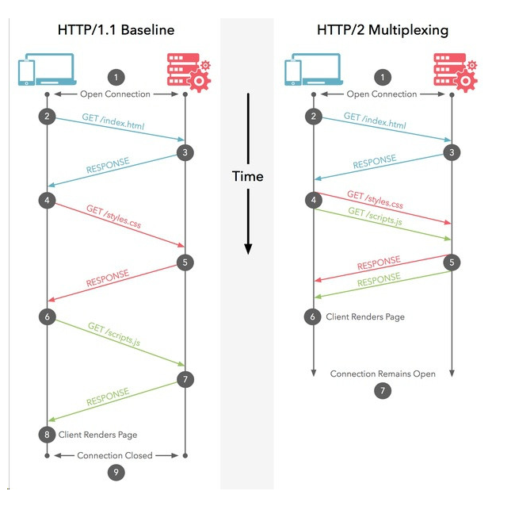
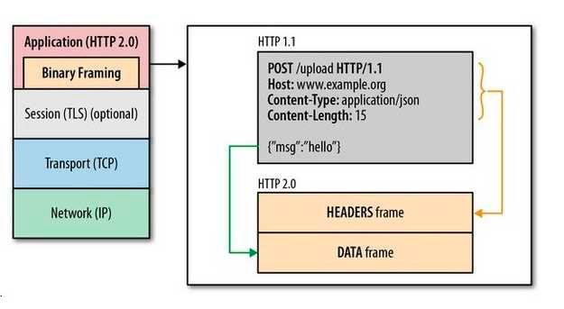
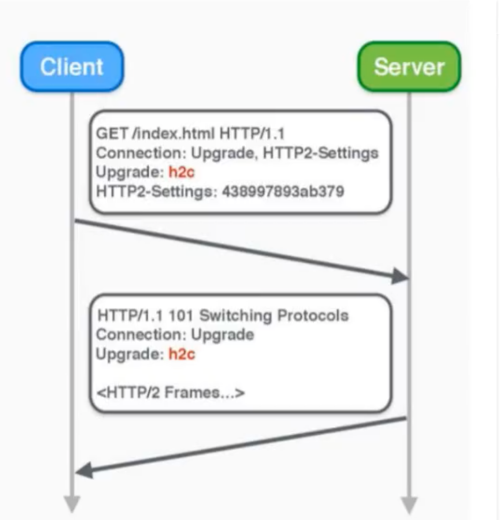
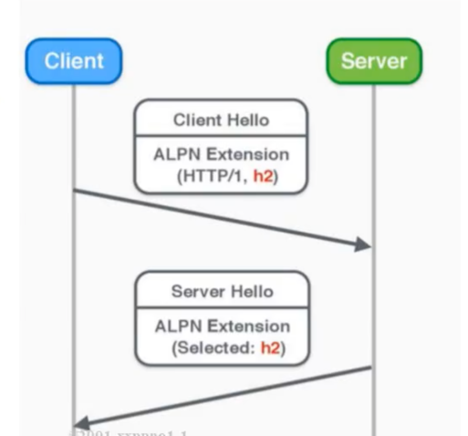

## 微服务框架

### 开发过程中的共性问题

* 客户端调用RPC

  * 网络通信

    * 连接管理
      * 建立连接
        * 发送数据包
        * 接收数据包
        * 超时控制
        * TCP粘包问题
      * 连接池
  * 数据传输问题

    * 序列化：本地数据结构转为网路字节流
    * 反序列化：网络字节流转为本地数据结构
  * 负载均衡问题

    * 随机算法
    * 轮训算法
    * 加权随机算法
    * 加权轮训算法
    * 一致性哈希算法
  * 服务发现

    * 通过服务名称发现服务位置（ip端口）
* 服务框架

  * 请求路由
    * 通过客户端调用的方法，路由到业务对应的处理函数
  * 日志组件
    * 服务访问记录需要记录
  * 异常处理
    * 限流与熔断
      * 限流策略
        * 令牌桶算法
      * 熔断策略
        * 电路熔断策略
      * 自动摘除
        * 服务注册、发现 自动摘除
  * 服务治理
    * 分布式追踪系统
      * Dapper论文
      * Zipkin http://ziplin.apache.org/
      * Jaeger http://www.jaegertracing.io/
      * Opentrace https://opentracing.io/
    * 服务监控
      * Metrics采样打点
        * Promentheus
        * Grafana 展示
* 服务架构图
  

### HTTP2.0介绍

http2在http1.1的基础上做了大量改进

* 多路复用(Multiplexing) / 连接共享
  
* 二进制分帧（Binary Format）- http2.0的基石
  
* 头部压缩（Header Compression）

| Index | Header Name      | Header Value |
| ------- | ------------------ | -------------- |
| 1     | :authority       |              |
| 2     | :method          | GET          |
| 3     | :method          | POST         |
| 4     | :path            | /            |
| 5     | :path            | /index.html  |
| 6     | :scheme          | http         |
| 7     | :scheme          | https        |
| 8     | :status          | 200          |
| ...   | ...              | ...          |
| 32    | cookie           |              |
| ...   | ...              | ...          |
| 60    | via              |              |
| 61    | www-authenticate |              |

* 服务器推送（Server Push）

#### HTTP2 协议协商

> Upgrade 用于未加密的http2 (http)
>
> ALPN 适用于加密的http2  (https)

* Upgrade机制(WebSocket连接建立的过程也是使用了Upgrade协商机制)

  * 客户端主动发起
    * 如果服务端支持http2，返回101 switchimg protocol
    * 如果服务端不支持http2，直接忽略，返回http1.1的内容
    * 版本标识符
      * 字符串 "h2c" 标识运行在明文TCP之上的HTTP/2协议（http模式）
      * 字符串 "h2" 标识运行在TLS的HTTP/2协议（https模式）

        

        > Chrome和Firefox只支持加密（TLS）的http2
        >
* ALPN

  > **应用层协议协商**（**Application-Layer Protocol Negotiation**，简称**ALPN**）是 [TLS](https://developer.mozilla.org/zh-CN/docs/Glossary/TLS) 的一个扩展，故而应用层协议在协商加密协议的过程中，避免了额外的往返通讯开销
  >

  * 客户端主动发起
    * 如果服务端支持http2，则返回selected h2
    * 如果服务端不支持http2，则返回selected http1.1
  * 协商的时机
    * 在http交换加密秘钥的过程中进行协商
    * ALPN只应用于https的http2.0

  

#### HTTPS 密码交换协商

* 秘钥协商

  * 浏览器使用Https的URL访问服务器，建立SSL链接。
  * 服务器接收到SSL链接后，发送非对称加密的公钥A给浏览器。
  * 浏览器生成随机数，作为对称加密的密钥B。
  * 浏览器使用服务器返回的公钥A，对自己生成的对称加密密钥B进行加密，得到密钥C。
  * 浏览器将密钥C发送给服务器
  * 服务器使用自己的私钥D对接受的密钥C进行解密，得到对称加密密钥B。
  * 浏览器和服务器之间使用密钥B作为对称加密密钥进行通信
  * 优点:非对称加密只使用了一次， 后续所有的通信消息都是用对称加密，效率比非对称加密高。
* 中间人攻击（https）

  * 当服务器发送公钥给客户端，**中间人截获公钥**；
  * 将**中间人自己的公钥**冒充服务器的公钥发送给客户端；
  * 之后客户端会用 **中间人的公钥**来加密自己生成的 **对称秘钥**；
  * 然后把加密的密钥发送给服务器，这时中间人又把密钥截取
  * 中间人用自己的私钥把加密的秘钥进行解密，解密后中间人就能获取**对称加密的密钥**

  > 如何解决中间人攻击，就要需要使用**数字证书**
  >
* 数字证书

  * 认证中心（CA）：

    一个拥有公信力、大家都认可的认证中心，数字证书认证机构
  * 证书内容

    * 签发者
    * 证书用途
    * 公钥
    * 加密算法
    * hash算法
    * 证书到期时间

    > P257集
    >
