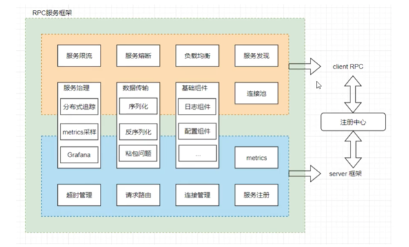

## 微服务框架

### 开发过程中的共性问题

* 客户端调用RPC

  * 网络通信

    * 连接管理
      * 建立连接
        * 发送数据包
        * 接收数据包
        * 超时控制
        * TCP粘包问题
      * 连接池
  * 数据传输问题

    * 序列化：本地数据结构转为网路字节流
    * 反序列化：网络字节流转为本地数据结构
  * 负载均衡问题

    * 随机算法
    * 轮训算法
    * 加权随机算法
    * 加权轮训算法
    * 一致性哈希算法
  * 服务发现

    * 通过服务名称发现服务位置（ip端口）
* 服务框架

  * 请求路由
    * 通过客户端调用的方法，路由到业务对应的处理函数
  * 日志组件
    * 服务访问记录需要记录
  * 异常处理
    * 限流与熔断
      * 限流策略
        * 令牌桶算法
      * 熔断策略
        * 电路熔断策略
      * 自动摘除
        * 服务注册、发现 自动摘除
  * 服务治理
    * 分布式追踪系统
      * Dapper论文
      * Zipkin http://ziplin.apache.org/
      * Jaeger http://www.jaegertracing.io/
      * Opentrace https://opentracing.io/
    * 服务监控
      * Metrics采样打点
        * Promentheus
        * Grafana 展示
* 服务架构图
  
